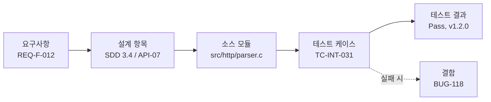

# 실무 소프트웨어 개발 단계별 산출물 가이드

> 소프트웨어 개발 생명주기(SDLC)의 각 단계에서 **무엇을 만들어야 하는지**, **왜 필요한지**, **무엇을 담아야 하는지**를 정리한 문서다.
> 국제 표준(ISO/IEC/IEEE 12207, 15289 등)과 국내 공공·SI 실무 관행을 바탕으로 하되, 프로젝트 규모에 맞게 **테일러링(취사선택)** 하는 것을 전제로 한다.

---

## 목차

1. [한눈에 보는 산출물 목록](#1-한눈에-보는-산출물-목록)
2. [착수·기획 단계](#2-착수기획-단계)
3. [요구사항 분석 단계](#3-요구사항-분석-단계)
4. [설계 단계](#4-설계-단계)
5. [구현 단계](#5-구현-단계)
6. [테스트 단계](#6-테스트-단계)
7. [배포·이행 단계](#7-배포이행-단계)
8. [운영·유지보수 단계](#8-운영유지보수-단계)
9. [전 단계 공통 산출물](#9-전-단계-공통-산출물)
10. [추적성: 산출물은 서로 연결되어야 한다](#10-추적성-산출물은-서로-연결되어야-한다)
11. [프로젝트 규모·방법론별 테일러링](#11-프로젝트-규모방법론별-테일러링)
12. [참고 표준](#12-참고-표준)
13. [webserv 프로젝트 적용안](#13-webserv-프로젝트-적용안)

---

## 1. 한눈에 보는 산출물 목록


| 단계 | 핵심 산출물 (필수에 가까움) | 선택 산출물 (규모·상황에 따라) |
|------|---------------------------|------------------------------|
| **착수·기획** | 프로젝트 헌장, 프로젝트 수행계획서, WBS·일정표 | 타당성 검토서, 비즈니스 케이스, 이해관계자 등록부, 의사소통 계획서 |
| **요구사항 분석** | 요구사항 명세서(SRS), 요구사항 추적표(RTM) | 현행 시스템 분석서, 유스케이스 명세서, 유저 스토리·백로그, 화면 프로토타입, 용어집 |
| **설계** | 아키텍처 설계서, 상세 설계서, 데이터베이스 설계서(ERD·테이블 정의서), 인터페이스 설계서 | 화면 설계서(UI 스토리보드), ADR, 보안 설계서, 코딩 표준, 클래스·시퀀스 다이어그램 |
| **구현** | 소스 코드, 빌드 스크립트, 단위 테스트 코드 | 코드 리뷰 기록, 단위 테스트 결과서, 정적 분석 결과서, API 문서 |
| **테스트** | 테스트 계획서, 테스트 케이스(시나리오), 테스트 결과서, 결함 관리 대장 | 성능·부하 테스트 결과서, 보안 취약점 점검 결과서, 사용자 인수 테스트(UAT) 결과서 |
| **배포·이행** | 배포(릴리스) 계획서, 릴리스 노트, 설치·운영 매뉴얼 | 데이터 이행 계획·결과서, 롤백 계획서, 사용자 매뉴얼, 교육 자료 |
| **운영·유지보수** | 운영 매뉴얼(런북), 장애 보고서, 변경 요청서 | SLA 문서, 모니터링 대시보드 정의, 포스트모템, 인수인계서 |
| **전 단계 공통** | 형상관리 계획, 회의록, 이슈·위험 관리 대장, 변경 이력 | 주간·월간 보고서, 품질보증(QA) 점검표, 검토(리뷰) 기록 |

---

## 2. 착수·기획 단계

**목표:** "이 프로젝트를 왜, 무엇을 위해, 어떤 자원으로, 언제까지 하는가"에 대한 합의를 문서로 고정한다.

### 2.1 프로젝트 헌장 (Project Charter)

- **목적:** 프로젝트의 존재를 공식 승인하고 PM에게 권한을 부여한다. 이후 범위 논쟁이 생기면 가장 먼저 돌아오는 기준 문서다.
- **주요 내용**
  - 프로젝트 목적·배경, 기대 효과(비즈니스 가치)
  - 상위 수준 범위(포함/제외 항목)
  - 주요 마일스톤, 개략 예산
  - 핵심 이해관계자와 의사결정권자, PM
  - 상위 수준 위험과 가정·제약사항
- **작성 주체:** 스폰서·PM / **승인:** 스폰서(발주자)
- **실무 팁:** "제외 범위(Out of Scope)"를 반드시 명시한다. 범위 확장(scope creep)을 막는 가장 싼 방법이다.

### 2.2 타당성 검토서 / 비즈니스 케이스 (선택)

- **목적:** 투자할 가치가 있는지 판단한다.
- **주요 내용:** 기술적 타당성(구현 가능성, 기술 위험), 경제적 타당성(비용 대비 효과, ROI), 운영적 타당성(조직이 운영할 수 있는가), 대안 비교(자체 개발 vs 구매 vs 오픈소스)
- **언제 필요한가:** 신규 시스템, 대규모 투자, 외부 발주 전.

### 2.3 프로젝트 수행계획서 (Project Management Plan)

- **목적:** 프로젝트를 "어떻게" 수행할지 정의한다. 범위·일정·비용·품질·인력·위험·의사소통 관리 방법을 한 곳에 모은다.
- **주요 내용**
  - 개발 방법론(폭포수, 애자일/스크럼, 하이브리드)과 단계 정의
  - 조직 구성과 역할·책임(R&R, RACI 매트릭스)
  - 일정 계획, 산출물 목록과 제출 시점
  - 품질 관리 계획(리뷰·테스트 기준), 위험 관리 계획
  - 형상 관리·변경 통제 절차
  - 의사소통 계획(정기 회의, 보고 주기, 채널)
- **작성 주체:** PM / **검토:** 발주자·PMO

### 2.4 WBS(Work Breakdown Structure)와 일정표

- **목적:** 전체 작업을 관리 가능한 크기의 작업 패키지로 분해하고, 일정·담당자를 배정한다.
- **주요 내용:** 계층형 작업 분해 구조, 작업별 산출물·담당자·기간, 선후행 관계, 마일스톤, 간트 차트
- **실무 팁:** 작업 패키지는 보통 **1~2주(8~80시간) 이내**로 쪼갠다. 너무 크면 진척 측정이 안 되고, 너무 작으면 관리 비용이 커진다.

### 2.5 이해관계자 등록부 / 의사소통 계획서 (선택)

- **이해관계자 등록부:** 누가 프로젝트에 영향을 주고받는지(사용자, 운영팀, 보안팀, 외부 연동 기관 등), 관심사와 영향력을 정리한다.
- **의사소통 계획서:** 누구에게, 무엇을, 언제, 어떤 채널로 전달하는지 정의한다.

---

## 3. 요구사항 분석 단계

**목표:** "무엇을 만들 것인가"를 검증 가능한 형태로 정의하고 이해관계자와 합의한다. 이 단계의 오류는 뒤 단계로 갈수록 수정 비용이 기하급수적으로 커진다.

### 3.1 현행 시스템 분석서 (선택)

- **목적:** 기존 시스템·업무를 대체하거나 개선할 때, 현재 상태(As-Is)를 파악해 개선 목표(To-Be)의 근거를 만든다.
- **주요 내용:** 현행 업무 흐름, 현행 시스템 구성·데이터, 문제점과 개선 요구, 연계 시스템 목록

### 3.2 요구사항 명세서 (SRS, Software Requirements Specification) ★

- **목적:** 개발·테스트·인수의 **단일 기준**이 되는 문서. 설계자는 이것을 보고 설계하고, 테스터는 이것을 보고 테스트 케이스를 만들며, 발주자는 이것을 보고 인수한다.
- **주요 내용**
  - **기능 요구사항:** 시스템이 수행해야 할 동작 (입력·처리·출력, 예외 처리)
  - **비기능 요구사항:** 성능(응답 시간, 처리량), 가용성, 보안, 확장성, 호환성, 사용성
  - **인터페이스 요구사항:** 사용자 인터페이스, 외부 시스템 연동, 하드웨어·통신 인터페이스
  - **데이터 요구사항:** 관리 대상 데이터, 보존 기간, 데이터 품질
  - **제약사항:** 사용 기술·언어·표준, 법·규제
  - 요구사항별 **고유 ID, 우선순위, 출처, 인수 기준**
- **좋은 요구사항의 조건 (ISO/IEC/IEEE 29148 기준)**
  - 필요성(Necessary), 명확성(Unambiguous), 완전성(Complete), 일관성(Consistent), 실현 가능성(Feasible), **검증 가능성(Verifiable)**, 추적 가능성(Traceable)
- **나쁜 예 vs 좋은 예**
  - ❌ "시스템은 빠르게 응답해야 한다."
  - ✅ "REQ-NF-003: 동시 사용자 1,000명 환경에서 조회 API의 95번째 백분위 응답 시간은 500ms 이하여야 한다."
- **작성 주체:** 분석가·PO / **승인:** 발주자 (승인 후 기준선(Baseline) 설정, 이후 변경은 변경 통제 절차를 따름)

### 3.3 유스케이스 명세서 / 유저 스토리 (선택, 방법론에 따라)

- **유스케이스 명세서(전통적 방식):** 액터, 사전·사후 조건, 기본 흐름, 대안 흐름, 예외 흐름을 시나리오 단위로 기술한다. 유스케이스 다이어그램과 함께 쓴다.
- **유저 스토리(애자일):** `As a <역할>, I want <기능>, so that <가치>` 형식 + **인수 조건(Acceptance Criteria)**. 제품 백로그로 관리한다.
- **실무 팁:** 인수 조건을 `Given / When / Then` 형식으로 쓰면 그대로 테스트 시나리오로 전환할 수 있다.

### 3.4 화면 프로토타입 / 와이어프레임 (선택)

- **목적:** 말로는 합의가 어려운 UI 요구사항을 조기에 시각적으로 검증한다. "이게 아닌데"를 개발 전에 발견한다.
- **형태:** 손그림, Figma 등의 와이어프레임, 클릭 가능한 목업

### 3.5 요구사항 추적표 (RTM, Requirements Traceability Matrix) ★

- **목적:** 각 요구사항이 설계 → 구현 → 테스트까지 **빠짐없이 반영되었는지** 추적한다. 누락된 요구사항과 근거 없는 기능(gold plating)을 찾아낸다.
- **주요 내용:** 요구사항 ID ↔ 설계 항목 ↔ 소스 모듈 ↔ 테스트 케이스 ID ↔ 테스트 결과
- **언제 작성:** 이 단계에서 만들고, 이후 모든 단계에서 열을 채워 나간다. (자세한 내용은 [10장](#10-추적성-산출물은-서로-연결되어야-한다))

### 3.6 용어집 (Glossary) (선택이지만 강력 추천)

- **목적:** 도메인 용어·약어의 의미를 통일한다. 같은 단어를 서로 다르게 이해해서 생기는 결함은 생각보다 많다.

---

## 4. 설계 단계

**목표:** 요구사항을 "어떻게" 구현할지 결정한다. 크게 **아키텍처 설계(큰 구조)** 와 **상세 설계(모듈 내부)** 로 나뉜다.

### 4.1 아키텍처 설계서 (SAD, Software Architecture Document) ★

- **목적:** 시스템의 전체 구조와 핵심 기술 결정을 기록한다. 비기능 요구사항(성능, 가용성, 보안 등)을 어떻게 달성하는지 보여준다.
- **주요 내용**
  - 아키텍처 목표·제약사항, 품질 속성 시나리오
  - **여러 관점(View)의 구조**
    - 논리 뷰: 컴포넌트·모듈 구성과 책임
    - 프로세스(실행) 뷰: 프로세스·스레드, 동시성, 런타임 흐름
    - 배포(물리) 뷰: 서버, 네트워크, 클라우드 인프라 배치
    - 개발 뷰: 소스 구조, 패키지·레이어 구성
  - 기술 스택 선정과 근거
  - 주요 설계 결정과 트레이드오프
- **표현 기법:** 4+1 View Model, **C4 Model**(Context → Container → Component → Code), UML 컴포넌트·배포 다이어그램
- **작성 주체:** 아키텍트 / **검토:** 기술 리더, 보안·인프라 담당

### 4.2 아키텍처 결정 기록 (ADR, Architecture Decision Record) (선택, 강력 추천)

- **목적:** "왜 이렇게 만들었는가"를 남긴다. 6개월 뒤 신규 인력이 같은 논쟁을 반복하지 않게 한다.
- **형식(짧게 1페이지):** 제목 / 상태(제안·승인·폐기) / 맥락 / 결정 / 고려한 대안 / 결과(장단점)
- **실무 팁:** 저장소의 `docs/adr/0001-*.md`처럼 코드와 함께 버전 관리하면 가장 잘 살아남는다.

### 4.3 상세 설계서 (SDD, Software Design Description) ★

- **목적:** 개발자가 바로 구현할 수 있을 수준으로 모듈 내부를 정의한다.
- **주요 내용**
  - 모듈(클래스) 목록, 책임, 의존 관계
  - 클래스 다이어그램, 시퀀스 다이어그램, 상태 다이어그램
  - 주요 알고리즘·처리 로직, 예외 처리 방침
  - 함수·메서드 시그니처와 입출력 명세
- **실무 팁:** 모든 것을 문서로 쓰면 코드와 금방 어긋난다. **복잡하거나 결정이 필요한 부분**에 집중하고, 자명한 부분은 코드와 주석에 맡긴다.

### 4.4 데이터베이스 설계서 ★ (DB를 쓰는 경우)

- **구성**
  - **개념·논리 ERD:** 엔터티, 속성, 관계, 정규화 결과
  - **물리 ERD / 테이블 정의서:** 테이블·컬럼명, 데이터 타입, 길이, NULL 여부, 기본값, PK·FK, 인덱스, 제약조건
  - 코드(공통코드) 정의서, 데이터 사전(Data Dictionary)
  - 데이터 보존·백업·암호화 정책
- **작성 주체:** DA/DBA·백엔드 개발자

### 4.5 인터페이스 설계서 ★ (외부·내부 연동이 있는 경우)

- **목적:** 시스템 간·모듈 간 계약(Contract)을 정의한다. 연동 결함의 대부분은 이 계약이 모호해서 생긴다.
- **주요 내용**
  - 인터페이스 목록(송신·수신 시스템, 방식, 주기)
  - 프로토콜(HTTP/REST, gRPC, 메시지 큐, 파일, 소켓 등)
  - 요청·응답 메시지 포맷(필드, 타입, 필수 여부, 길이)
  - 오류 코드 체계, 타임아웃·재시도 정책, 인증 방식
- **실무 형태:** OpenAPI(Swagger) 명세, Protocol Buffers 정의, AsyncAPI 등 **기계가 읽을 수 있는 형식**을 권장한다. 문서와 코드·테스트를 자동으로 동기화할 수 있다.

### 4.6 화면(UI) 설계서 (선택, UI가 있는 경우)

- **주요 내용:** 화면 목록·ID, 화면 흐름도(내비게이션), 화면별 레이아웃, 입력 항목과 유효성 검증 규칙, 버튼·이벤트 동작, 오류 메시지
- **실무 형태:** 스토리보드, Figma 디자인 파일 + 디자인 시스템

### 4.7 보안 설계서 (선택, 보안 요구가 있으면 사실상 필수)

- **주요 내용:** 위협 모델링 결과(예: STRIDE), 인증·인가 방식, 암호화 대상과 알고리즘, 입력 검증·출력 인코딩 정책, 개인정보 처리 방안, 감사 로그 정책

### 4.8 코딩 표준 / 개발 가이드 (선택, 팀 개발이면 추천)

- **주요 내용:** 명명 규칙, 포맷 규칙(포매터·린터 설정), 에러 처리 방식, 로깅 규칙, 브랜치·커밋 규칙, 코드 리뷰 기준
- **실무 팁:** 문서보다 **자동화된 도구 설정**(`.clang-format`, `.editorconfig`, ESLint 설정, pre-commit 훅)이 훨씬 잘 지켜진다.

---

## 5. 구현 단계

**목표:** 설계를 동작하는 코드로 만들고, 최소 단위의 품질을 확보한다.

### 5.1 소스 코드 ★

- 형상관리 시스템(Git 등)에 저장된 코드 자체가 가장 중요한 산출물이다.
- **함께 관리해야 할 것:** 의미 있는 커밋 이력, 브랜치 전략, 태그(버전)

### 5.2 빌드 스크립트·빌드 환경 정의 ★

- **예:** `Makefile`, `CMakeLists.txt`, `package.json`, `build.gradle`, `Dockerfile`, CI 파이프라인 설정
- **목적:** 누가, 어디서 빌드해도 **같은 결과물**이 나오게 한다(재현 가능한 빌드).

### 5.3 단위 테스트 코드 및 결과 ★

- **단위 테스트 코드:** 함수·클래스 단위 동작 검증. 리팩토링의 안전망 역할.
- **단위 테스트 결과서(선택):** 실행 결과, 커버리지(라인·브랜치), 실패 항목 조치 내역
- **실무 팁:** 결과서를 손으로 쓰기보다 CI가 자동 생성하는 리포트(JUnit XML, 커버리지 리포트)를 산출물로 삼는 것이 효율적이다.

### 5.4 코드 리뷰 기록 (선택)

- **형태:** PR(Pull Request) 리뷰 코멘트, 리뷰 체크리스트
- **목적:** 결함 조기 발견, 지식 공유, 코딩 표준 준수 확인

### 5.5 정적 분석 결과서 (선택, 공공·보안 프로젝트는 사실상 필수)

- **내용:** 정적 분석 도구(SonarQube, Coverity, clang-tidy 등) 결과, 시큐어 코딩 점검 결과, 조치 내역
- **참고:** 국내 공공 정보화 사업은 소프트웨어 보안약점 진단(시큐어 코딩 점검)이 요구된다.

### 5.6 API 문서·코드 레벨 문서 (선택)

- **예:** Doxygen, Javadoc, JSDoc으로 생성한 API 레퍼런스, `README.md`
- **README에 최소한 담을 것:** 프로젝트 소개, 빌드·실행 방법, 디렉터리 구조, 설정 방법, 테스트 실행 방법

---

## 6. 테스트 단계

**목표:** 시스템이 요구사항을 만족하는지 **검증(Verification)** 하고, 사용자가 원하는 것인지 **확인(Validation)** 한다.

테스트 레벨은 보통 다음 순서로 진행한다.

```
단위 테스트 → 통합 테스트 → 시스템 테스트 → 인수 테스트(UAT)
 (구현 단계)     (모듈 간)     (전체·비기능)    (사용자 관점)
```

### 6.1 테스트 계획서 ★

- **목적:** 무엇을, 어떻게, 언제, 누가, 어떤 기준으로 테스트할지 정한다.
- **주요 내용**
  - 테스트 범위(대상·제외 항목), 테스트 레벨과 유형(기능, 성능, 보안, 호환성, 회귀)
  - 테스트 전략과 설계 기법(동등 분할, 경계값 분석, 결정 테이블, 상태 전이 등)
  - 테스트 환경(하드웨어, OS, 데이터, 도구)
  - 일정·인력·역할
  - **진입·종료 기준(Entry/Exit Criteria):** 예) "치명·높음 결함 0건, 요구사항 커버리지 100%"
  - 결함 관리 절차, 위험과 대응

### 6.2 테스트 케이스 / 테스트 시나리오 ★

- **주요 항목:** 테스트 케이스 ID, 관련 요구사항 ID, 사전 조건, 테스트 데이터, 수행 절차, **기대 결과**, 우선순위
- **실무 팁:** 기대 결과가 모호하면("정상 동작한다") 테스트가 아니다. 상태 코드·출력값·로그처럼 **판정 가능한 결과**를 쓴다.

### 6.3 테스트 결과서 ★

- **주요 내용:** 케이스별 수행 결과(Pass/Fail/Blocked), 수행일·수행자·환경·빌드 버전, 실패 시 결함 ID, 요구사항 커버리지, 종료 기준 충족 여부
- **테스트 종료 보고서(Test Summary Report):** 레벨별 결과를 요약하고, 잔여 위험과 출시 가능 여부에 대한 의견을 제시한다.

### 6.4 결함 관리 대장 (Defect / Bug Report) ★

- **주요 항목:** 결함 ID, 제목, 재현 절차, 기대 결과 vs 실제 결과, 심각도(Severity)·우선순위(Priority), 환경, 첨부(로그·스크린샷), 상태(신규 → 할당 → 수정 → 재테스트 → 종료), 원인 분석
- **실무 형태:** Jira, GitHub Issues 등 이슈 트래커
- **심각도와 우선순위는 다르다:** 심각도는 기술적 영향, 우선순위는 처리 순서(비즈니스 판단)다.

### 6.5 비기능 테스트 결과서 (선택, 해당 요구가 있으면 필수)

- **성능·부하 테스트 결과서:** 목표 대비 응답 시간, 처리량(TPS), 자원 사용률, 병목 분석, 장시간 안정성(soak test)
- **보안 취약점 점검 결과서:** 모의해킹·취약점 스캔 결과와 조치 내역
- **호환성 테스트 결과서:** 브라우저·OS·디바이스별 결과

### 6.6 사용자 인수 테스트(UAT) 결과서 / 검수 확인서

- **목적:** 발주자·실사용자가 직접 확인하고 **인수(검수)를 공식 승인**한다. 계약상 프로젝트 종료의 근거가 된다.

---

## 7. 배포·이행 단계

**목표:** 검증된 소프트웨어를 운영 환경에 안전하게 반영하고, 문제가 생기면 되돌릴 수 있게 한다.

### 7.1 배포(릴리스) 계획서 ★

- **주요 내용:** 배포 일시·대상 환경, 배포 절차(단계별 체크리스트), 담당자와 연락망, 사전 점검 항목, 서비스 중단 여부와 공지, **배포 후 검증 항목(Smoke Test)**
- **롤백 계획:** 어떤 조건에서 롤백을 결정하는지, 롤백 절차와 소요 시간. 롤백 계획 없는 배포 계획은 미완성이다.

### 7.2 릴리스 노트 ★

- **주요 내용:** 버전 번호, 배포일, 신규 기능, 변경 사항, 수정된 결함, **알려진 이슈(Known Issues)**, 호환성 변경·마이그레이션 안내(Breaking Change)
- **실무 팁:** Conventional Commits를 쓰면 커밋 이력에서 `CHANGELOG.md`를 자동 생성할 수 있다. 버전은 Semantic Versioning(`MAJOR.MINOR.PATCH`)을 많이 쓴다.

### 7.3 데이터 이행 계획서·결과서 (선택, 데이터 전환이 있는 경우)

- **주요 내용:** 이행 대상 데이터와 매핑 규칙(As-Is → To-Be), 이행 절차·도구, 검증 방법(건수·합계 대사), 실패 시 대응, 리허설 결과

### 7.4 설치 매뉴얼 / 운영자 매뉴얼 ★

- **설치 매뉴얼:** 시스템 요구사항, 설치·설정 절차, 환경 변수·설정 파일 설명, 설치 확인 방법
- **운영자 매뉴얼:** 기동·종료, 설정 변경, 로그 위치와 해석, 백업·복구, 정기 점검 항목

### 7.5 사용자 매뉴얼 / 교육 자료 (선택, 최종 사용자가 있는 경우)

- **사용자 매뉴얼:** 기능별 사용 방법, 화면 설명, FAQ, 오류 메시지 대응
- **교육 자료:** 교육 계획, 교재, 교육 결과(참석자, 만족도)

---

## 8. 운영·유지보수 단계

**목표:** 시스템을 안정적으로 운영하고, 변경을 통제된 방식으로 반영하며, 지식이 사람과 함께 사라지지 않게 한다.

### 8.1 운영 런북 (Runbook) ★

- **목적:** 장애·정기 작업 시 **누가 보더라도 따라 할 수 있는 절차서**.
- **주요 내용:** 알람별 대응 절차, 자주 발생하는 장애와 조치 방법, 재기동 절차, 에스컬레이션 경로·연락처

### 8.2 장애 보고서 / 포스트모템 ★

- **주요 내용:** 장애 개요(발생·인지·복구 시각, 영향 범위), 타임라인, **근본 원인(Root Cause)**, 즉시 조치, 재발 방지 대책과 담당·기한
- **실무 팁:** 개인 책임 추궁이 아니라 시스템·프로세스 개선에 초점을 둔 **비난 없는(Blameless) 포스트모템** 문화를 권장한다.

### 8.3 변경 요청서 (CR, Change Request) ★

- **주요 내용:** 요청 내용과 사유, 영향 분석(관련 요구사항·설계·코드·테스트, 일정·비용), 승인 여부, 반영 버전
- **목적:** 운영 중 변경도 요구사항 → 설계 → 구현 → 테스트 → 배포 흐름을 다시 타게 만들어, 문서와 시스템이 어긋나지 않게 한다.

### 8.4 SLA / 모니터링 정의서 (선택)

- **SLA(Service Level Agreement):** 가용성 목표(예: 월 99.9%), 장애 대응 시간, 측정 방법
- **모니터링 정의서:** 수집 지표(SLI), 임계치, 알람 규칙, 대시보드 구성

### 8.5 인수인계서 (선택, 담당자 교체·유지보수 이관 시 필수)

- **주요 내용:** 시스템 개요와 아키텍처, 주요 산출물 위치, 접속 정보 관리 방법(비밀번호 자체는 문서에 쓰지 않고 보관 위치만 안내), 진행 중 이슈, 알려진 기술 부채, 연락처

---

## 9. 전 단계 공통 산출물

특정 단계에 속하지 않고 프로젝트 전체에 걸쳐 지속적으로 갱신되는 산출물이다.

| 산출물 | 목적 | 주요 내용 |
|--------|------|-----------|
| **형상관리 계획서** | 무엇을, 어떻게 버전 관리할지 정의 | 형상 항목(코드·문서·설정), 저장소 구조, 브랜치 전략, 기준선(Baseline) 설정 시점, 변경 통제 절차 |
| **변경 이력 (Revision History)** | 문서·코드가 언제, 왜 바뀌었는지 추적 | 각 문서 상단의 버전·일자·변경자·변경 내용 표, Git 커밋 이력 |
| **회의록** | 결정 사항과 책임 소재 기록 | 일시·참석자, 안건, **결정 사항**, **액션 아이템(담당·기한)** |
| **이슈·위험 관리 대장** | 문제와 잠재 위험을 조기에 다룸 | 이슈·위험 ID, 내용, 발생 가능성·영향도, 대응 계획, 담당, 상태 |
| **진척 보고서** | 이해관계자에게 상태 공유 | 계획 대비 실적, 주요 성과, 이슈·위험, 다음 기간 계획 |
| **검토(리뷰) 기록** | 산출물 품질 확보 | 검토 대상·검토자, 지적 사항, 조치 결과 (요구사항·설계·코드·테스트 리뷰) |
| **품질보증(QA) 점검표** | 프로세스·산출물이 계획대로 수행되는지 확인 | 단계별 점검 항목, 부적합 사항, 시정 조치 |

> **이슈와 위험의 차이:** 위험(Risk)은 "아직 발생하지 않았지만 발생할 수 있는 것", 이슈(Issue)는 "이미 발생한 문제"다. 위험이 현실화되면 이슈가 된다.

---

## 10. 추적성: 산출물은 서로 연결되어야 한다

산출물은 따로 존재하면 가치가 반감된다. **요구사항 하나가 어떤 설계로, 어떤 코드로, 어떤 테스트로 검증되었는지** 양방향으로 따라갈 수 있어야 한다.



**요구사항 추적표(RTM) 예시**

| 요구사항 ID | 요구사항 요약 | 설계 항목 | 구현 모듈 | 테스트 케이스 | 결과 |
|-------------|---------------|-----------|-----------|---------------|------|
| REQ-F-012 | 요청 헤더 크기 초과 시 431 응답 | SDD 3.4 | `http/parser` | TC-INT-031 | Pass |
| REQ-F-013 | 설정 파일 문법 오류 시 기동 실패 | SDD 2.1 | `config/loader` | TC-UNIT-044, TC-SYS-007 | Pass |
| REQ-NF-003 | 조회 API p95 응답 500ms 이하 | SAD 5.2 | `api/query` | TC-PERF-002 | Fail → BUG-120 |

**추적성으로 얻는 것**

- **순방향 추적(요구사항 → 테스트):** 테스트되지 않은 요구사항(누락)을 찾는다.
- **역방향 추적(코드 → 요구사항):** 요구사항 근거 없는 기능(불필요한 구현)을 찾는다.
- **영향 분석:** 요구사항이 바뀌면 어떤 설계·코드·테스트를 고쳐야 하는지 즉시 알 수 있다.

---

## 11. 프로젝트 규모·방법론별 테일러링

모든 산출물을 모든 프로젝트에서 만들 필요는 없다. 산출물은 **위험을 줄이고 의사소통을 돕는 수단**이지 목적이 아니다. "이 문서가 없으면 어떤 문제가 생기는가?"에 답할 수 없는 문서는 만들지 않는다.

### 11.1 규모별 권장 수준

| 구분 | 소규모 (1~3인, 사내 도구·개인/학습 프로젝트) | 중규모 (팀 단위 제품) | 대규모·공공·SI (외부 발주, 계약 기반) |
|------|--------------------------|----------------------|--------------------------------------|
| 기획 | README의 목표·범위 섹션 | 프로젝트 헌장, 로드맵 | 수행계획서, WBS, 의사소통 계획서 등 전체 |
| 요구사항 | 이슈 목록 또는 간단한 요구사항 문서 | 유저 스토리 + 인수 조건, 핵심 비기능 요구사항 | 공식 SRS, RTM, 요구사항 승인·기준선 관리 |
| 설계 | 핵심 구조 다이어그램, ADR 몇 개 | 아키텍처 설계서(C4), ADR, API 명세 | SAD, SDD, DB·인터페이스·화면·보안 설계서 |
| 구현 | 코드, 테스트, README | + 코드 리뷰, CI, 정적 분석 | + 시큐어 코딩 점검 결과서, 단위 테스트 결과서 |
| 테스트 | 자동화 테스트 + CI 결과 | 테스트 전략, 주요 시나리오, 결함 트래커 | 테스트 계획서·케이스·결과서, 성능·보안 결과서, UAT |
| 배포·운영 | CHANGELOG, 실행 방법 | 릴리스 노트, 런북, 포스트모템 | 배포·이행 계획서, 각종 매뉴얼, 교육 자료, 인수인계서 |

### 11.2 폭포수 vs 애자일

| 관점 | 폭포수(Waterfall) | 애자일(Scrum 등) |
|------|-------------------|------------------|
| 작성 시점 | 단계 시작 전·종료 시 일괄 작성, 단계 종료 승인 | 스프린트마다 점진적으로 작성·갱신 |
| 요구사항 | SRS(기준선 고정 후 변경 통제) | 제품 백로그, 유저 스토리, 인수 조건 |
| 진척 관리 | WBS, 간트 차트, 진척률 | 스프린트 백로그, 번다운 차트, 칸반 보드 |
| 검토·회고 | 단계별 공식 검토(Review) | 스프린트 리뷰, 회고(Retrospective) 기록 |
| 완료 기준 | 단계 종료 기준(Exit Criteria) | 완료 정의(DoD, Definition of Done) |
| 문서 철학 | 문서가 계약과 인계의 근거 | "동작하는 소프트웨어 > 포괄적인 문서" — 문서를 없애라는 뜻이 아니라 **필요한 만큼만, 살아 있게** |

### 11.3 산출물을 "살아 있게" 유지하는 실무 원칙

1. **코드 가까이에 둔다.** 설계 문서·ADR·API 명세를 저장소(`docs/`)에 두고 코드와 같은 PR에서 갱신한다(Docs as Code).
2. **기계가 읽을 수 있는 형식을 우선한다.** OpenAPI, 스키마 마이그레이션 파일, CI 설정은 그 자체로 정확한 문서다.
3. **생성할 수 있는 것은 생성한다.** API 레퍼런스, 테스트 리포트, 커버리지, CHANGELOG는 도구로 자동 생성한다.
4. **"왜"에 집중한다.** "무엇"은 코드가 말해 주지만, "왜 이렇게 결정했는가"는 문서에만 남는다.
5. **각 문서에 소유자와 갱신 시점을 정한다.** 소유자 없는 문서는 반드시 낡는다.

---

## 12. 참고 표준

| 표준 | 다루는 내용 |
|------|-------------|
| ISO/IEC/IEEE 12207 | 소프트웨어 생명주기 프로세스 전반 |
| ISO/IEC/IEEE 15289 | 생명주기 정보 항목(문서·산출물)의 내용 |
| ISO/IEC/IEEE 29148 | 요구사항 엔지니어링, 요구사항 명세서 구성 |
| ISO/IEC/IEEE 42010 | 아키텍처 기술(Architecture Description) |
| IEEE 1016 | 소프트웨어 설계 기술서(SDD) |
| ISO/IEC/IEEE 29119 (Part 3) | 소프트웨어 테스트 문서(계획서·케이스·결과서) |
| IEEE 828 | 형상관리(Configuration Management) |
| ISO/IEC 25010 | 소프트웨어 제품 품질 모델(비기능 요구사항 분류 기준) |
| ISO/IEC/IEEE 16326 | 프로젝트 관리 |

---

## 13. webserv 프로젝트 적용안

> 근거: [`0.subject.md`](0.subject.md), [`0.evaluation-sheet.md`](0.evaluation-sheet.md)

### 13.1 테일러링 방향

webserv는 [11.1](#111-규모별-권장-수준)의 **소규모** 프로젝트에 해당하지만, 다음 특성 때문에 일부 산출물은 중규모 수준으로 끌어올린다.

- **DB·화면 설계·운영 배포가 없다.** 관련 산출물은 전부 제외한다.
- **평가가 체크리스트 기반이고, 일부 항목은 즉시 0점이다.** 항목 누락을 막는 **요구사항 추적(RTM)** 의 가치가 크다.
- **평가 중 코드 흐름 설명·간단한 코드 수정을 요구받는다.** "왜 이렇게 만들었는가"를 남기는 **아키텍처 설계서·ADR** 의 가치가 크다.
- **동작이 정의되지 않은 부분이 많다.** 판단 순서(① 원문 명시 요구 ② RFC 등 일반 사항 ③ NGINX)에 따른 결정을 기록해야 일관성이 유지된다.

### 13.2 적용 산출물 (핵심)

| 산출물 | 위치(안) | 필요한 이유 | webserv에서 담을 내용 |
|---|---|---|---|
| **요구사항 명세서(SRS)** | `docs/1.requirements-specification.md` | 서브젝트·평가표의 모호한 문장을 검증 가능한 요구사항으로 바꾸는 기준 문서 | 외부에서 관찰되는 동작(HTTP 메서드, 상태 코드, 업로드, 디렉터리 리스팅, 리다이렉트, CGI), 비기능 요구사항(크래시·hang 금지, siege 가용성 99.5% 이상, 누수 없음), 외부 인터페이스(CLI, 설정 파일, HTTP, CGI), 제약사항(C++98, 허용 함수, 단일 `poll()`, `errno` 검사 금지) |
| **요구사항 추적표(RTM)** | SRS 부록 또는 `docs/1-1.traceability.md` | 평가표 항목 하나라도 빠지면 감점이고, 일부는 0점 | 서브젝트·평가표 항목 → 요구사항 ID → 설계 항목 → 테스트 ID. "즉시 0점 항목"은 반드시 테스트와 연결 |
| **아키텍처 설계서** | `docs/2-1.architecture.md` | "`select()`부터 read/write까지 코드 흐름을 보여달라"는 질문에 그대로 쓸 수 있는 문서 | C4의 Container·Component 수준 구성(이벤트 루프, 연결 관리, 요청 파서, 라우터, 정적·업로드·삭제·CGI 핸들러, 설정 파서), **실행 뷰**(fd 생명주기, 단일 `poll()`에 리슨 소켓·클라이언트 소켓·CGI 파이프를 등록하는 방식) |
| **상세 설계 (핵심 부분만)** | `docs/2-2.*.md` | 이 프로젝트 결함의 대부분이 여기서 발생 | 연결 상태 전이도(읽기 → 파싱 → 처리 → 쓰기 → keep-alive/종료), 요청 파서 상태 머신(chunked 포함), CGI 시퀀스(fork, 파이프, 타임아웃, `waitpid`, EOF 처리), 타임아웃 정책 |
| **ADR (설계 결정 기록)** | `docs/adr/NNNN-*.md` | 평가자 질문과 평가 중 코드 수정 요청에 바로 답할 수 있고, NGINX와 다르게 동작하는 이유를 남길 수 있음 | 예: `poll()`·`epoll`·`kqueue` 선택, 알 수 없는 메서드에 501 응답(NGINX는 405), `root` 경로 해석 방식, 같은 포트 중복 설정 시 기동 실패, 요청 본문 크기 제한 방식 |
| **설정 파일 문법 명세** | SRS 외부 인터페이스 장 + `docs/2-x` | 설정 파일은 평가표 1.2 전체가 걸린 핵심 외부 인터페이스 | SRS: 지시어 목록, 문맥(`server`/`location`), 기본값, 문법 오류 시 동작. 설계 문서: EBNF 문법, 파서 구조 |
| **테스트 계획서 (간략판)** | `docs/3.test-plan.md` | 테스트 범위와 완료 기준이 있어야 평가 신청 시점을 판단할 수 있음 | 레벨별 범위(단위, 통합: 실제 소켓, 시스템: 브라우저·siege·평가용 테스터), 종료 기준(즉시 0점 항목 0건, 요구사항 커버리지 100%, siege 장시간 실행 시 누수 없음) |
| **테스트 코드 + 자동 결과** | `tests/` | 서브젝트가 Python·Go 등으로 테스트를 직접 작성하라고 권장 | Python 통합 테스트(테스트 ID를 요구사항 ID와 연결), siege 실행 스크립트, valgrind·leaks 결과. 결과서는 손으로 쓰지 않고 실행 로그로 대신함 |
| **README** | `/README.md` | **서브젝트 필수 요건**(영문 작성) | 첫 줄(이탤릭체 로그인 문구), Description, Instructions, Resources, **AI를 어떤 작업에 썼는지** |
| **데모용 설정 파일과 웹 루트** | 예: `conf/`, `www/` | **서브젝트 필수 요건**으로, 평가에서 모든 기능을 시연하는 데 사용 | 평가표 1.2~1.6의 각 항목을 시연할 설정 파일과 파일들(에러 페이지, 업로드 경로, CGI 스크립트, 무한 루프·에러용 CGI 포함) |

### 13.3 가볍게 적용 (도구로 대체)

| 일반 산출물 | webserv에서의 대체 형태 |
|---|---|
| 코딩 표준 | 문서 대신 Makefile 플래그(`-Wall -Wextra -Werror -std=c++98`), `.clang-format`, 기존 커밋 규칙으로 강제 |
| 결함·이슈 관리 대장 | GitHub Issues. 심각도에 "평가 즉시 0점 위험" 등급을 따로 둠 |
| WBS·일정표 | 마일스톤 몇 개(설정 파서 → 이벤트 루프 → 정적 GET → POST·업로드·DELETE → CGI → 스트레스 테스트 → 보너스) |
| 회의록 | 팀 프로젝트라면 결정 사항과 담당자 위주로 짧게 기록하고, 중요한 결정은 ADR로 옮김 |
| 보안 설계서 | 별도 문서 대신 SRS 비기능 요구사항과 ADR로 다룸. 대상 위협: 경로 탈출(`../`), 과대 요청 본문·헤더, 느린 클라이언트(slowloris 유형), CGI 폭주 |
| 사용자 인수 테스트(UAT) | [`0.evaluation-sheet.md`](0.evaluation-sheet.md)의 "방어 전 자체 점검 체크리스트"를 인수 테스트 체크리스트로 사용 |

### 13.4 적용하지 않음

프로젝트 헌장, 타당성 검토서, 이해관계자 등록부, 의사소통 계획서, DB 설계서, 화면 설계서, 데이터 이행 계획서, 배포·롤백 계획서, SLA, 운영 런북, 교육 자료, 포스트모템, QA 점검표, 모든 모듈에 대한 상세 설계서.

이 프로젝트의 위험을 줄이는 데 기여하지 않고, 문서와 코드가 어긋나는 원인만 늘리기 때문이다.

### 13.5 문서 배치 원칙

| 접두어 | 성격 | 예 |
|---|---|---|
| `0.` | 원문·참고 자료 (수정하지 않는 기준 문서) | `0.subject.md`, `0.evaluation-sheet.md`, 이 문서 |
| `1.` / `1-x.` | 요구사항 ("무엇을") | `1.requirements-specification.md`, `1-1.traceability.md` |
| `2-x.` / `adr/` | 설계 ("어떻게"와 "왜") | `2-1.architecture.md`, `adr/0001-*.md` |
| `3.` | 테스트 | `3.test-plan.md` |

- SRS에는 요구사항 수준의 내용만 둔다. 구현 수단(함수·시스템 콜 선택, 내부 절차, 상수)과 테스트 절차는 각각 설계 문서와 테스트 문서로 분리한다.
- 요구사항 문서는 설계 문서를 참조하지 않는다(요구사항 ↔ 설계 순환 참조 방지). 연결은 RTM이 담당한다.

### 13.6 진행 순서

1. **SRS와 RTM 뼈대:** 서브젝트·평가표 항목에 ID를 붙여 RTM의 첫 열을 채운다.
2. **아키텍처 설계서와 ADR:** 이벤트 루프와 CGI 처리 방식을 가장 먼저 결정한다.
3. **구현과 테스트 코드를 함께 진행:** 테스트 ID를 RTM에 연결한다.
4. **평가 신청 직전:** README, 데모용 설정 파일, siege·누수 검사 결과를 정리하고 13.3의 인수 테스트 체크리스트를 통과시킨다.
